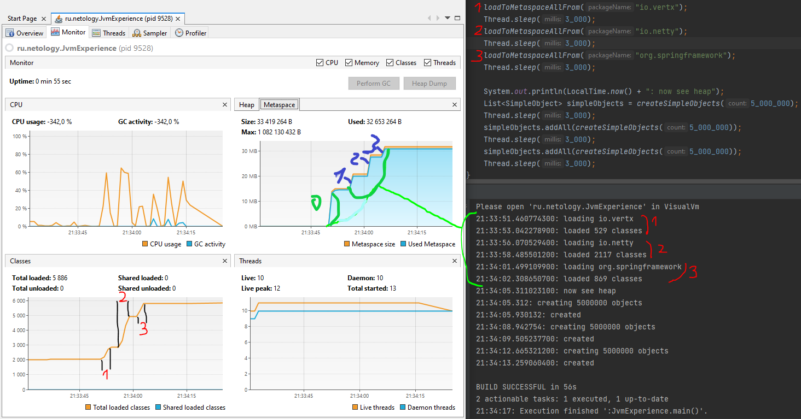

# Задача "Исследование JVM через VisualVM"

## Описание

Изучение использования памяти через VisualVM при загрузке новых классов и создании новых объектов на основе проекта
[jvm-visualvm-experience](https://github.com/Arsennikum/jvm-visualvm-experience)

## Результат исследования

0. Сначала осуществляется загрузка информации о классах, неоходимых для работы программы, в блок памяти Metaspace при
   помощи ClassLoader'ов

В первом блоке программы (до пустой строки) идет загрузка информации о классах из пакетов:

1. io.vertx,
2. io.netty,
3. org.springframework.

На скрине отмечены данные понкты в коде программы, в логе выполнения, а также в VisualVM на вкладке `Monitor` в
разделах `Metaspace` и `Classes`:

---
Во втором блоке программы (после пустой строки) идет трижды выполнение создания объектов.
Ниже на скрине цифрами 1,2,3 указано соответствие между кодом программы, логом выполнения и потреблением памяти в
разделе `Heap`). Синими цифрами обозначены моменты реального потребления памяти, а зелеными - последующее выделение
зарезервированной памяти в "куче".

Периодически по мере необходимости срабатывает "Сборщик мусора" (в разделе `Heap` цифра 4).

 